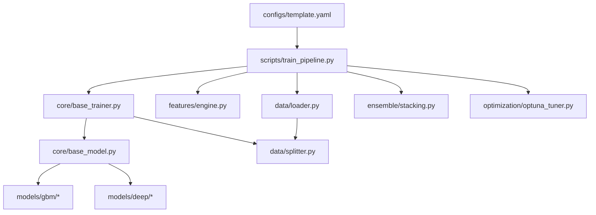
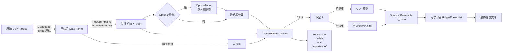

# 军火库实战操作手册
## Data Mining Arsenal — Field Operations Manual

> **定位：** 面向结构化数据、推荐系统、时间序列预测赛道的生产级竞赛代码库。
> 从原始 CSV 到最终提交文件，一条 YAML 配置驱动全链路自动化。

---

## 目录

1. [架构概览](#1-架构概览)
2. [核心工作流](#2-核心工作流)
3. [快速上手](#3-快速上手)
4. [YAML 配置完全指南](#4-yaml-配置完全指南)
5. [深度学习模型接入](#5-深度学习模型接入)
6. [进阶实战建议](#6-进阶实战建议)
7. [开发者扩展手册](#7-开发者扩展手册)
8. [常见问题 FAQ](#8-常见问题-faq)

---

## 1. 架构概览

### 1.1 目录结构

```
kaggle-arsenal/
│
├── core/               ★ 骨架层：定义所有接口契约
│   ├── base_model.py       抽象基类 BaseModel（fit/predict/save/load）
│   └── base_trainer.py     CrossValidatorTrainer（OOF 生成引擎）
│
├── data/               ★ 数据层：入口守卫
│   ├── loader.py           内存优化加载（dtype 压缩、分块读取）
│   └── splitter.py         CV 切分工厂（7 种策略）
│
├── features/           ★ 特征工程层：主战场
│   └── engine.py           FeaturePipeline + 原子 Transformer 集合
│
├── models/             ★ 武器库
│   ├── gbm/                GBM 三剑客（LGBM / XGB / CatBoost）
│   └── deep/               深度学习四件套（DeepFM / DIN / TwoTower / ESMM）
│
├── ensemble/           ★ 集成层：决赛核武器
│   └── stacking.py         StackingEnsemble（OOF 驱动元学习）
│
├── optimization/       ★ 自动调参层
│   └── optuna_tuner.py     OptunaTuner（贝叶斯搜索 + 剪枝 + 持久化）
│
├── utils/              ★ 基础设施层（横切所有层）
│   └── memory.py           dtype 压缩 / 内存监控工具
│
├── configs/            ★ 配置中心
│   └── template.yaml       竞赛配置模板（YAML 驱动）
│
├── scripts/            ★ 入口脚本
│   └── train_pipeline.py   全链路指挥部（唯一入口）
│
└── outputs/            ★ 实验产物（gitignore）
    └── exp_<name>_<ts>/    每次运行自动创建时间戳目录
```

### 1.2 分层依赖关系



### 1.3 设计哲学

| 原则 | 实现方式 |
|---|---|
| **配置即代码** | 一切由 YAML 驱动，零硬编码 |
| **防泄露优先** | 特征工程强制 OOF 变换，Target Encoding 在折内计算 |
| **接口统一** | 所有模型继承 `BaseModel`，签名完全一致 |
| **渐进增强** | 无 torch → 只用 GBM；有 torch → 自动解锁深度模型 |
| **实验可复现** | 随机种子全局注入，配置副本写入实验目录 |

---

## 2. 核心工作流

### 2.1 完整数据流



### 2.2 内存优化加载

`DataLoader` 在读取时自动压缩 dtype，大型数据集内存占用通常降低 **50%–70%**：

```python
# 内部压缩规则
int64  → int32 / int16 / int8   （按值域自动选择）
float64 → float32
object  → category              （唯一值 < 阈值时）
```

```python
# 手动调用
from data.loader import DataLoader

loader   = DataLoader(compress=True, verbose=True)
train_df = loader.load("data/train.parquet")   # 支持 csv / parquet / feather
test_df  = loader.load("data/test.parquet")
```

### 2.3 OOF 防泄露特征工程

```
核心问题：若在全量训练集上计算 Target Encoding → 验证集已知标签 → CV 虚高 → 线上崩

正确做法（fit_transform_oof）：

  Fold 1: 用 fold2+3+4+5 fit → transform fold1
  Fold 2: 用 fold1+3+4+5 fit → transform fold2
  ...
  每一折的验证集都只看到「其他折」的标签统计
```

```python
from features.engine import FeaturePipeline, GroupAggTransformer, TargetEncoderTransformer

pipeline = FeaturePipeline(
    transformers=[
        GroupAggTransformer(group_keys=[["store_id"]], agg_cols="sales"),
        TargetEncoderTransformer(cat_cols=["city"], smoothing=20.0),
    ],
    keep_original=True,
)

folds    = cv.split(X_train, y_train)
X_fe, X_test_fe = pipeline.fit_transform_oof(X_train, y_train,
                                              folds=folds, X_test=X_test)
```

### 2.4 CrossValidatorTrainer — OOF 生成引擎

```python
from core.base_trainer import CrossValidatorTrainer, MetricConfig
from models.gbm.lgbm_wrapper import LGBMModel
from sklearn.metrics import roc_auc_score

model   = LGBMModel(task="binary", seed=42)
trainer = CrossValidatorTrainer(
    model   = model,
    cv      = cv,
    metrics = [MetricConfig("auc", roc_auc_score, higher_is_better=True, primary=True)],
    task    = "binary",
)
result = trainer.fit(X_train, y_train, X_test=X_test)

# result 包含：
result.oof_predictions   # np.ndarray (N,)  — 可进 Stacking
result.test_predictions  # np.ndarray (M,)  — 各折均值
result.cv_scores         # dict[str, list]  — 每折分数
result.oof_score         # dict[str, float] — 全量 OOF 分数
result.feature_importance  # pd.DataFrame
```

### 2.5 Stacking 融合

```python
from ensemble.stacking import StackingEnsemble, StackingConfig

stacker = StackingEnsemble(
    results      = [lgbm_result, xgb_result, catboost_result],
    model_names  = ["lgbm", "xgb", "catboost"],
    config       = StackingConfig(task="binary", scale_meta_features=True),
)
sr = stacker.fit(y_train)

# sr.meta_oof    → 元模型 OOF（可继续堆叠）
# sr.meta_test   → 最终提交预测
# sr.model_weights → 各基模型权重（分析谁立了功）
print(stacker.diversity_report())       # 相关性诊断
print(stacker.oof_score_report(y_train, roc_auc_score, "auc"))
```

---

## 3. 快速上手

### 3.1 安装依赖

```bash
# 基础环境（GBM + 结构化数据）
pip install lightgbm xgboost catboost optuna scikit-learn pandas numpy pyarrow pyyaml

# 深度学习支持（可选）
pip install torch --index-url https://download.pytorch.org/whl/cu118
pip install deepctr-torch>=0.9.0

# 可视化（可选）
pip install matplotlib seaborn
```

### 3.2 三步启动一场比赛

**Step 1：准备数据**
```bash
cp your_train.csv data/train.csv
cp your_test.csv  data/test.csv
```

**Step 2：编写配置文件**
```bash
cp configs/template.yaml configs/my_comp.yaml
# 编辑 my_comp.yaml：修改数据路径、目标列、CV 策略、模型参数
```

**Step 3：启动训练**
```bash
# 完整流程
python scripts/train_pipeline.py --config configs/my_comp.yaml

# 先验证配置合法性（不实际训练）
python scripts/train_pipeline.py --config configs/my_comp.yaml --dry-run

# 跳过 Optuna 调参（快速出结果）
python scripts/train_pipeline.py --config configs/my_comp.yaml --no-tune

# 只跑前 2 折（调试用）
python scripts/train_pipeline.py --config configs/my_comp.yaml --fold-only 0 1
```

### 3.3 查看实验结果

```
outputs/my_comp_20260315_143022/
├── config.yaml          ← 本次实验的配置快照
├── pipeline.log         ← 完整训练日志
├── report.json          ← 所有 CV 分数汇总
├── models/              ← 各折保存的模型文件
├── oof/                 ← OOF 预测（.npy）
├── importance/          ← 特征重要性（.csv + .png）
└── submissions/
    ├── submission_lgbm.csv      ← 单模型备用
    └── submission_final.csv     ← Stacking 最终提交  ★
```

```python
# 读取实验报告
import json
with open("outputs/my_comp_.../report.json") as f:
    report = json.load(f)

print(report["models"]["lgbm"]["oof_scores"])   # {'auc': 0.8524}
print(report["ensemble"]["oof_score"])           # {'auc': 0.8617}
print(report["timing"]["total_seconds"])         # 689
```

---

## 4. YAML 配置完全指南

### 4.1 配置文件结构总览

```yaml
experiment:   # 实验元信息
data:         # 数据路径与列名
cv:           # 交叉验证策略
features:     # 特征工程流水线
models:       # 模型列表（可多个）
tuning:       # Optuna 超参搜索
ensemble:     # Stacking 配置
metrics:      # 评估指标
output:       # 输出控制
```

### 4.2 CV 策略选择指南

```yaml
cv:
  strategy: "stratified_kfold"   # 二分类首选，保持标签比例
  # strategy: "kfold"            # 回归任务
  # strategy: "group_kfold"      # 用户级防泄露（推荐系统）
  # strategy: "timeseries"       # 时序数据（纯时间切分）
  # strategy: "purged_timeseries" # 时序 + gap 防泄露
  n_splits: 5
  group_col: "user_id"           # GroupKFold 时必填
  gap: 7                         # 时序切分：train/val 间隔天数
```

| 赛道 | 推荐策略 | 原因 |
|---|---|---|
| 结构化分类 | `stratified_kfold` | 标签分布稳定 |
| 结构化回归 | `kfold` | 无需分层 |
| 推荐系统 | `group_kfold` (user_id) | 防同一用户出现在训练和验证集 |
| 时序预测 | `purged_timeseries` | 防未来信息泄露 |

### 4.3 模型快速切换示例

```yaml
models:
  # 只用 LightGBM（最快）
  - name: "lgbm"
    type: "LGBMModel"
    enabled: true
    params:
      num_leaves: 63
      learning_rate: 0.05

  # 禁用 XGBoost（改 enabled: false 即可）
  - name: "xgb"
    type: "XGBModel"
    enabled: false       # ← 一行禁用，无需删除配置

  # 加入 DeepFM（需要 torch 环境）
  - name: "deepfm"
    type: "DeepFMModel"
    enabled: true
    params:
      dnn_hidden_units: [256, 128]
      learning_rate: 0.001
      batch_size: 4096
      epochs: 50
```

### 4.4 开启 Optuna 调参

```yaml
tuning:
  enable: true
  n_trials: 100             # 搜索轮数（建议生产用 50~200）
  timeout: 7200             # 最长秒数，null = 不限时
  sampler: "tpe"            # tpe（默认） | random | cmaes
  pruner: "median"          # median（默认） | hyperband | none
  storage: "sqlite:///outputs/tuning.db"   # 持久化，支持断点续传
  models_to_tune: ["lgbm"]  # 只对指定模型调参
```

> **建议：** 第一次搜索用 `n_trials: 50` 快速探索，拿到合理范围后再用 `n_trials: 200` 精搜。

### 4.5 特征 Transformer 配置参考

```yaml
features:
  enable: true
  use_oof_transform: true   # 强烈建议保持 true

  transformers:
    # 时间特征（周期 Sin/Cos 编码）
    - type: TimeFeatureTransformer
      enabled: true
      params:
        date_col: "date"
        cyclic: ["month", "dayofweek", "hour"]

    # GroupBy 聚合（支持多维度）
    - type: GroupAggTransformer
      enabled: true
      params:
        group_keys: [["store_id"], ["store_id", "item_id"]]
        agg_cols: "sales"
        agg_funcs: ["mean", "std", "max", "min", "median"]

    # 时序差分（支持滑动窗口）
    - type: DiffTransformer
      enabled: true
      params:
        value_cols: ["sales"]
        diff_periods: [1, 7, 28]
        rolling_windows: [7, 14, 28]
        rolling_funcs: ["mean", "std"]
        group_by: "item_id"
        sort_by: "date"

    # Lag 特征
    - type: LagTransformer
      enabled: true
      params:
        value_cols: ["sales"]
        lags: [1, 7, 14, 28]
        group_by: "item_id"
        sort_by: "date"

    # Target Encoding（自动防泄露）
    - type: TargetEncoderTransformer
      enabled: true
      params:
        cat_cols: ["store_id", "item_id"]
        smoothing: 20.0     # 平滑系数，防止小样本过拟合
```

---

## 5. 深度学习模型接入

### 5.1 环境准备

```bash
pip install torch deepctr-torch>=0.9.0
# GPU 版本：
pip install torch --index-url https://download.pytorch.org/whl/cu118
```

### 5.2 DeepFM — 结构化 CTR 基线

```yaml
# configs/recsys.yaml
models:
  - name: "deepfm"
    type: "DeepFMModel"
    enabled: true
    params:
      embedding_dim: 8          # 类别特征 Embedding 维度
      dnn_hidden_units: [256, 128]
      dnn_dropout: 0.1
      l2_reg_embedding: 1e-6
      learning_rate: 0.001
      batch_size: 4096
      epochs: 50
      patience: 5               # Early Stopping
      device: "auto"            # 自动检测 GPU
```

```python
# 代码直接调用
from models.deep.deepfm_wrapper import DeepFMModel

model = DeepFMModel(task="binary", seed=42)
model.fit(X_train, y_train, X_val=X_val, y_val=y_val)
proba = model.predict_proba(X_test)
```

> **数据要求：** 类别列请提前转为 `category` dtype，数值列保持 `int/float`，DeepFM 会自动分拣。

```python
# 确保类别列编码正确
for col in cat_cols:
    df[col] = df[col].astype("category")
```

### 5.3 DIN — 用户行为序列建模

DIN 的核心是让「目标物品」对用户历史行为做 Attention，找到最相关的历史记录。

#### 数据格式准备

```python
# 用户历史点击序列：存为列表或空格分隔字符串（均支持）
df["hist_item_id_list"] = [
    [101, 32, 7, 55],     # Python list
    "101 32 7",           # 空格分隔字符串
    None,                 # 新用户：自动补零
]
df["item_id"] = [55, 12, 88]  # 目标商品（当前候选）
df["item_id"] = df["item_id"].astype("category")
```

#### YAML 配置

```yaml
models:
  - name: "din"
    type: "DINModel"
    enabled: true
    seq_configs:                      # ← DIN 专属：声明序列特征
      - seq_col: "hist_item_id_list"  #   序列列名
        target_col: "item_id"         #   对应的目标商品列（共享 Embedding）
        maxlen: 50                    #   序列截断长度（保留最近 50 个行为）
      - seq_col: "hist_cate_list"     # 可配置多个序列
        target_col: "cate_id"
        maxlen: 50
    params:
      embedding_dim: 8
      dnn_hidden_units: [256, 128]
      att_hidden_size: [80, 40]
      att_activation: "dice"    # DIN 论文推荐的数据自适应激活函数
      learning_rate: 0.001
      batch_size: 4096
      patience: 5
```

#### 关键机制图示

```
用户历史：[鞋子A, 衬衫B, 裤子C, 帽子D, 鞋子E]
                          │
              Activation Unit（目标物品F 作为 Query）
                          │
             attention:  [0.1, 0.05, 0.05, 0.1, 0.7]  ← 鞋子E 最相关
                          │
              兴趣向量 = 0.1×e(鞋子A) + ... + 0.7×e(鞋子E)
                          │
                        DNN → pCTR
```

### 5.4 ESMM — 多目标学习（CTR + CVR）

ESMM 解决了 CVR 模型的**样本选择偏差**问题：CVR 传统上只在点击样本训练，但预测时却对全部曝光样本评分，存在分布偏移。

#### 标签准备（关键！）

```python
# label_click: 曝光后是否点击（全量样本都有标签）
# label_conversion: 曝光后是否最终转化（= click × convert_in_click）
df["label_click"]      = (df["action"] >= 1).astype(int)
df["label_conversion"] = (df["action"] == 2).astype(int)  # 点击且购买

# ✅ 正确：label_conversion 是曝光空间的转化标签
# ❌ 错误：label_conversion 只在点击样本上赋值（会导致 ESMM 退化）
```

#### YAML 配置

```yaml
models:
  - name: "esmm"
    type: "ESMMModel"
    enabled: true
    params:
      embedding_dim: 8
      dnn_hidden_units: [256, 128]
      ctr_loss_weight: 1.0      # CTR Loss 权重（可 Optuna 搜索）
      ctcvr_loss_weight: 1.0    # CTCVR Loss 权重
      label_click: "label_click"           # 点击标签列名
      label_conversion: "label_conversion" # 转化标签列名
      learning_rate: 0.001
      batch_size: 4096
      patience: 5

metrics:
  primary:
    name: "auc"
    func: "roc_auc_score"
    higher_is_better: true
    use_proba: true        # predict_proba 默认返回 pCTCVR
```

#### 获取多个任务分数

```python
# 训练后，三种预测接口
pctcvr  = model.predict_proba(X_test)          # 默认：pCTCVR（进 Stacking）
pctr    = model.predict_ctr(X_test)            # 点击率
pcvr    = model.predict_cvr(X_test)            # 转化率（= pCTCVR / pCTR）

# 一次性获取全部
scores_df = model.predict_all(X_test)
# scores_df.columns: ["pCTR", "pCVR", "pCTCVR"]

# 多目标排序融合（常见竞赛技巧）
scores_df["score"] = 0.3 * scores_df["pCTR"] + 0.7 * scores_df["pCVR"]
```

### 5.5 Two-Tower — 召回模型 + Faiss 检索

```yaml
models:
  - name: "two_tower"
    type: "TwoTowerModel"
    enabled: true
    user_cols: ["user_id", "age", "gender", "city_id"]   # 必填
    item_cols: ["item_id", "cate_id", "price", "brand"]  # 必填
    params:
      embedding_dim: 8
      user_tower_units: [256, 128, 64]
      item_tower_units: [256, 128, 64]
      output_dim: 64          # 向量维度
      temperature: 0.05       # InfoNCE 温度系数
      l2_normalize: true
      batch_size: 2048
```

```python
# 导出向量 → 写入 Faiss
import faiss

item_embs = model.get_item_embedding(X_all_items).astype("float32")  # (M, 64)
user_embs = model.get_user_embedding(X_users).astype("float32")      # (N, 64)

# 建索引（精确搜索）
index = faiss.IndexFlatIP(64)
faiss.normalize_L2(item_embs)
index.add(item_embs)

# 在线召回 Top-100
faiss.normalize_L2(user_embs)
distances, indices = index.search(user_embs, k=100)
```

---

## 6. 进阶实战建议

### 6.1 大规模 Optuna 超参搜索

#### 策略一：分模型异步搜索

```bash
# 多个终端并行搜索同一个 study（自动合并结果）
python scripts/train_pipeline.py --config configs/lgbm_tune.yaml &
python scripts/train_pipeline.py --config configs/lgbm_tune.yaml &
python scripts/train_pipeline.py --config configs/lgbm_tune.yaml &
```

```yaml
# configs/lgbm_tune.yaml
tuning:
  enable: true
  n_trials: 50
  storage: "sqlite:///outputs/lgbm_study.db"  # 共享持久化 storage
  study_name: "lgbm_comp_v1"                  # 相同 study_name → 结果合并
  models_to_tune: ["lgbm"]
```

#### 策略二：剪枝加速搜索

剪枝（Pruner）会在某次 trial 的前几折表现很差时提前终止，节省大量计算：

```yaml
tuning:
  pruner: "median"    # 比当前最好的 trial 中位数差 → 剪枝
  # pruner: "hyperband"  # 更激进，适合 epoch 多的深度模型
```

#### 策略三：读取历史 Study 继续搜索

```bash
# 之前搜了 50 trials，现在想继续搜到 200
# 直接修改 n_trials: 200，storage 和 study_name 保持一致即可
python scripts/train_pipeline.py --config configs/lgbm_tune.yaml
```

#### 策略四：可视化分析参数重要性

```python
import optuna
import optuna.visualization as vis

study = optuna.load_study(
    study_name="lgbm_comp_v1",
    storage="sqlite:///outputs/lgbm_study.db",
)

# 参数重要性：哪些超参数最值得搜索？
fig = vis.plot_param_importances(study)
fig.show()

# 优化历史：收敛了吗？
fig = vis.plot_optimization_history(study)
fig.show()

# 最优参数
print(study.best_params)
print(f"Best value: {study.best_value:.6f}")
```

### 6.2 特征工程实战技巧

#### 技巧一：类别特征的安全处理

```python
# 错误做法：全量 fit Target Encoding
from sklearn.preprocessing import TargetEncoder
enc = TargetEncoder().fit(X_train, y_train)           # ← 泄露！
X_train_enc = enc.transform(X_train)

# 正确做法：使用军火库的 OOF 变换
pipeline = FeaturePipeline(transformers=[
    TargetEncoderTransformer(cat_cols=["city"], smoothing=20.0)
])
folds = cv.split(X_train, y_train)
X_fe, _ = pipeline.fit_transform_oof(X_train, y_train, folds=folds)
```

#### 技巧二：时序特征的 Group 排序

```yaml
# DiffTransformer 和 LagTransformer 都需要指定排序列
- type: LagTransformer
  params:
    value_cols: ["sales"]
    lags: [1, 7, 14, 28]
    group_by: "item_id"    # 按商品分组
    sort_by: "date"        # 按日期排序（确保时序正确性）
```

#### 技巧三：特征重要性驱动筛选

```python
# 训练后，用 LGBM 的特征重要性删除低分特征
fi = result.feature_importance
low_fi_cols = fi[fi["importance_mean"] < 0.001]["feature"].tolist()
X_train_pruned = X_train.drop(columns=low_fi_cols)
```

### 6.3 Stacking 的多样性优化

Stacking 的效果取决于基模型的**多样性**，相关性越低提升越大：

```python
# 诊断基模型相关性
stacker = StackingEnsemble(results=[lgbm_r, xgb_r, deepfm_r], ...)
print(stacker.diversity_report())

# 典型输出：
# OOF 相关性矩阵：
#           lgbm    xgb  deepfm
# lgbm     1.000  0.952   0.731   ← lgbm 与 xgb 高度相关，提升有限
# xgb      0.952  1.000   0.724
# deepfm   0.731  0.724   1.000   ← deepfm 多样性高，值得保留
```

**提升 Stacking 多样性的技巧：**

| 方法 | 说明 |
|---|---|
| 混合模型类型 | GBM + 深度学习 + 线性模型 |
| 差异化特征子集 | 一个模型用所有特征，另一个只用原始特征 |
| 差异化 CV 种子 | 同模型不同随机种子的结果做均值 |
| 不同 CV 策略 | 5折 OOF + 10折 OOF 各作为一个基模型 |

### 6.4 推荐系统全链路配置

```yaml
# configs/recsys_full.yaml
experiment:
  name: "recsys_ctcvr"
  task: "binary"

cv:
  strategy: "group_kfold"    # 用户级防泄露
  n_splits: 5
  group_col: "user_id"

models:
  - name: "lgbm_base"
    type: "LGBMModel"
    enabled: true
    params: {num_leaves: 63, learning_rate: 0.05}

  - name: "deepfm"
    type: "DeepFMModel"
    enabled: true
    params: {dnn_hidden_units: [256, 128], learning_rate: 0.001}

  - name: "din"
    type: "DINModel"
    enabled: true
    seq_configs:
      - {seq_col: hist_item_id_list, target_col: item_id, maxlen: 50}
    params: {att_activation: dice}

  - name: "esmm"
    type: "ESMMModel"
    enabled: true
    params:
      label_click: "is_click"
      label_conversion: "is_buy"

ensemble:
  enable: true
  method: "stacking"
```

---

## 7. 开发者扩展手册

### 7.1 添加新模型（5 分钟上手）

所有模型必须继承 `BaseModel` 并实现以下接口契约：

```python
# core/base_model.py 规定的契约
from abc import ABC, abstractmethod
import pandas as pd
import numpy as np

class BaseModel(ABC):

    @abstractmethod
    def fit(self, X_train, y_train, X_val=None, y_val=None, **kwargs):
        """训练模型。支持验证集用于 Early Stopping。"""

    @abstractmethod
    def predict(self, X, **kwargs) -> np.ndarray:
        """返回预测值（回归输出原始值；分类输出类别或概率）。"""

    @abstractmethod
    def predict_proba(self, X, **kwargs) -> np.ndarray:
        """返回正例概率，shape=(N,)，dtype=float64。
        ⚠️ 这是进入 CrossValidatorTrainer 和 StackingEnsemble 的关键接口。"""

    @abstractmethod
    def save(self, path: str) -> None:
        """持久化模型到 path 目录。"""

    @abstractmethod
    def load(self, path: str) -> "BaseModel":
        """从 path 目录加载模型，返回 self。"""

    @property
    @abstractmethod
    def feature_importance(self) -> pd.DataFrame:
        """返回 DataFrame，columns=['feature', 'importance_mean']。"""

    @staticmethod
    def _seed_key() -> str:
        """返回构造函数中随机种子的参数名（如 'seed', 'random_state'）。"""
        return "seed"

    @staticmethod
    def suggest_params(trial) -> dict:
        """（可选）Optuna 搜索空间。OptunaTuner 会自动调用此方法。"""
        return {}
```

### 7.2 新模型实现模板

```python
# models/my_models/my_model_wrapper.py
from core.base_model import BaseModel
import numpy as np
import pandas as pd

class MyCustomModel(BaseModel):

    DEFAULT_PARAMS = {
        "n_estimators": 500,
        "learning_rate": 0.1,
        "seed": 42,
    }

    def __init__(self, params=None, task="binary", name="my_model", seed=42):
        merged = {**self.DEFAULT_PARAMS, **(params or {})}
        super().__init__(params=merged, task=task, name=name, seed=seed)
        self._model = None

    def fit(self, X_train, y_train, X_val=None, y_val=None, **kwargs):
        # 1. 初始化底层模型
        # 2. 训练（带 Early Stopping）
        # 3. 记录最优迭代轮数
        ...
        return self

    def predict_proba(self, X, **kwargs) -> np.ndarray:
        # 返回 float64 一维数组，shape=(N,)
        return self._model.predict(X).astype(np.float64)

    def predict(self, X, **kwargs) -> np.ndarray:
        return self.predict_proba(X, **kwargs)

    def save(self, path: str) -> None:
        import joblib, json
        from pathlib import Path
        Path(path).mkdir(parents=True, exist_ok=True)
        joblib.dump(self._model, f"{path}/model.pkl")
        with open(f"{path}/meta.json", "w") as f:
            json.dump({"params": self.params, "task": self.task}, f)

    def load(self, path: str) -> "MyCustomModel":
        import joblib, json
        self._model = joblib.load(f"{path}/model.pkl")
        return self

    @property
    def feature_importance(self) -> pd.DataFrame:
        fi = pd.DataFrame({
            "feature": ...,
            "importance_mean": ...,
        })
        return fi.sort_values("importance_mean", ascending=False)

    @staticmethod
    def _seed_key() -> str:
        return "seed"   # 你的模型构造函数里随机种子的参数名

    @staticmethod
    def suggest_params(trial) -> dict:
        return {
            "n_estimators":  trial.suggest_int("n_estimators", 100, 1000),
            "learning_rate": trial.suggest_float("learning_rate", 1e-3, 0.3, log=True),
        }
```

### 7.3 注册新模型到指挥系统

```python
# scripts/train_pipeline.py —— 两处修改

# 1. 导入
from models.my_models.my_model_wrapper import MyCustomModel

# 2. 注册表
_MODEL_REGISTRY["MyCustomModel"] = MyCustomModel
```

```yaml
# configs/my_comp.yaml —— YAML 直接使用
models:
  - name: "my_model"
    type: "MyCustomModel"
    enabled: true
    params:
      n_estimators: 500
      learning_rate: 0.05
```

### 7.4 添加新的特征 Transformer

```python
# features/engine.py 内部继承 BaseFeatureTransformer
from features.engine import BaseFeatureTransformer

class MyFeatureTransformer(BaseFeatureTransformer):

    def __init__(self, col_name: str, window: int = 7):
        super().__init__(name=f"my_feat_{col_name}")
        self.col_name = col_name
        self.window   = window

    def fit(self, X: pd.DataFrame, y=None) -> "MyFeatureTransformer":
        # 从训练集学习统计量（如均值、标准差）
        self._stats = X[self.col_name].mean()
        return self

    def transform(self, X: pd.DataFrame) -> pd.DataFrame:
        # 生成新特征，返回仅包含新列的 DataFrame
        result = pd.DataFrame(index=X.index)
        result[f"{self.col_name}_rolling_{self.window}"] = (
            X[self.col_name].rolling(self.window).mean()
        )
        self._generated_features = list(result.columns)
        return result
```

```python
# 注册并使用
from scripts.train_pipeline import _TRANSFORMER_REGISTRY
_TRANSFORMER_REGISTRY["MyFeatureTransformer"] = MyFeatureTransformer
```

### 7.5 添加新的评估指标

```python
# scripts/train_pipeline.py
from sklearn.metrics import matthews_corrcoef

_METRIC_REGISTRY["mcc"] = matthews_corrcoef
```

```yaml
metrics:
  primary:
    name: "mcc"
    func: "mcc"
    higher_is_better: true
    use_proba: false   # MCC 需要类别标签，不用概率
```

---

## 8. 常见问题 FAQ

### Q1：内存不足怎么办？

```python
# 方案 1：分块读取（DataLoader 内置）
loader = DataLoader(compress=True, chunksize=500_000)

# 方案 2：进一步手动降精度
from utils.memory import compress_dataframe
df = compress_dataframe(df, verbose=True)

# 方案 3：只保留有效列
df = df[useful_cols]
```

### Q2：CV 分数很高但线上崩了？

排查顺序：
1. **时序泄露**：检查是否用了 `kfold` 而不是 `timeseries` 切分
2. **Target Encoding 泄露**：确保 `use_oof_transform: true`
3. **GroupID 泄露**：同一用户的数据同时出现在训练集和验证集
4. **测试集分布偏移**：打印 `train_df.describe()` 和 `test_df.describe()` 对比

### Q3：DIN 序列特征如何处理新用户（冷启动）？

```python
# 新用户没有历史行为时，序列列填 None 或空列表
df.loc[new_user_mask, "hist_item_id_list"] = None
# SequencePadder 会自动将 None 填充为全零序列（padding_value=0）
```

### Q4：Stacking 的元学习器可以换吗？

```python
# StackingEnsemble 默认使用 Ridge，可以传入任意 sklearn 兼容的模型
from sklearn.linear_model import ElasticNet
from sklearn.ensemble import GradientBoostingClassifier

stacker = StackingEnsemble(
    results    = [r1, r2, r3],
    meta_model = ElasticNet(alpha=0.1, l1_ratio=0.5),  # 换元学习器
)
```

### Q5：如何在没有测试集时只生成 OOF 评估？

```yaml
data:
  test_path: null   # 设为 null 即可
```

```bash
python scripts/train_pipeline.py --config configs/my_comp.yaml
# 跳过测试集预测，只生成 OOF 分数和 report.json
```

### Q6：如何复现某次历史实验？

```bash
# 每个实验目录都保留了 config.yaml 快照，直接复用即可
python scripts/train_pipeline.py \
    --config outputs/my_comp_20260315_143022/config.yaml
```

---

## 附录：模型选型速查表

| 赛道 | 首选模型 | 备选 | 集成策略 |
|---|---|---|---|
| 结构化分类 | LightGBM | XGBoost + CatBoost | 三模型 Stacking |
| 结构化回归 | LightGBM | CatBoost | 均值融合 |
| CTR 预估 | DeepFM + LightGBM | DIN | Stacking |
| 多目标 (CTR+CVR) | ESMM | ESMM + LightGBM | Stacking |
| 大规模召回 | TwoTower + Faiss | — | ANN 检索 |
| 用户兴趣建模 | DIN | DIN + LightGBM | Stacking |
| 时序预测 | LightGBM + Lag 特征 | N-HiTS | 均值融合 |

## 附录：Optuna 超参数搜索范围参考

| 模型 | 关键参数 | 推荐搜索范围 |
|---|---|---|
| LightGBM | `num_leaves` | [15, 255] |
| LightGBM | `learning_rate` | [0.01, 0.3] (log) |
| LightGBM | `feature_fraction` | [0.5, 1.0] |
| XGBoost | `max_depth` | [3, 10] |
| XGBoost | `eta` | [0.01, 0.3] (log) |
| DeepFM | `embedding_dim` | [4, 8, 16, 32] |
| DeepFM | `learning_rate` | [1e-4, 1e-2] (log) |
| ESMM | `ctr_loss_weight` | [0.5, 2.0] |
| TwoTower | `temperature` | [0.01, 0.2] (log) |

---

*军火库 v1.0 — 持续更新中*
*如发现问题或有改进建议，欢迎提交 Issue。*
